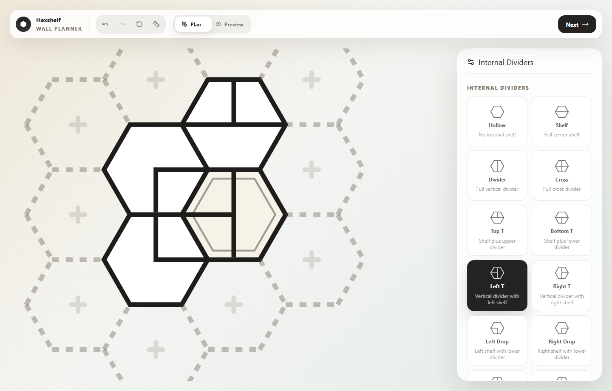
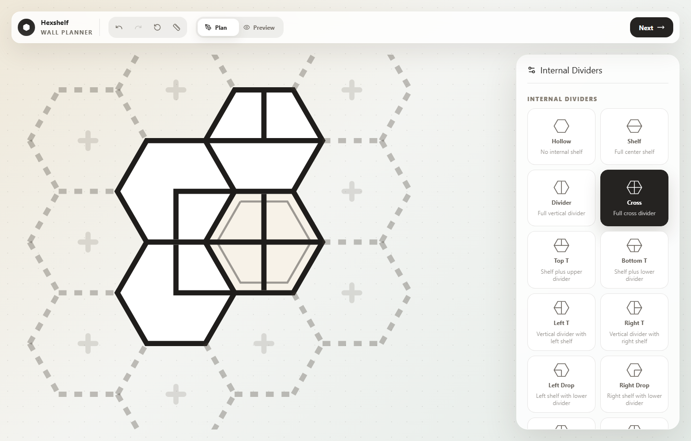
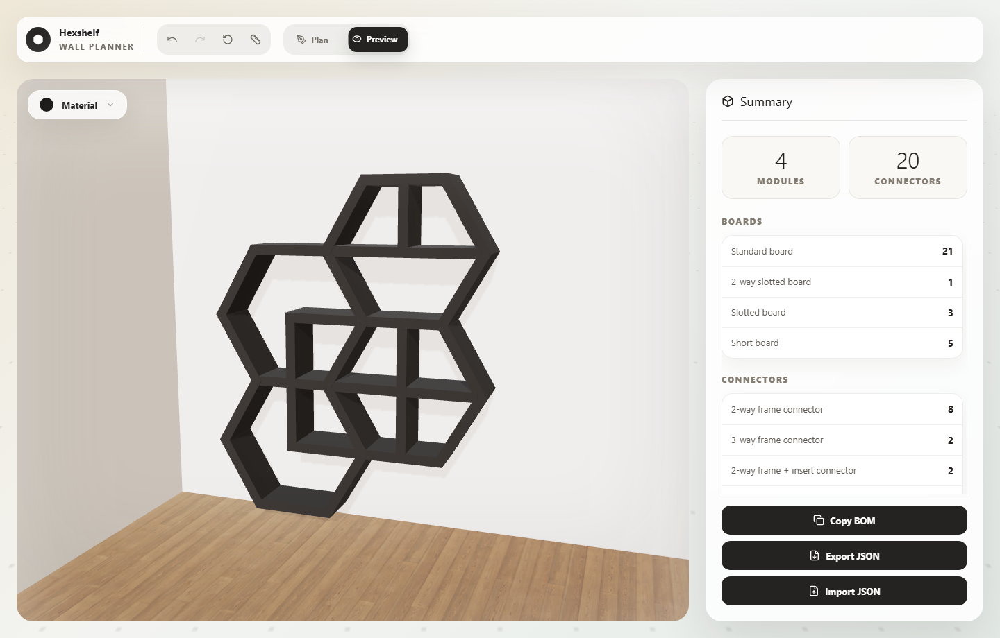

# Hexshelf Planner

Standalone browser planner for designing modular hex wall shelves and producing a print-ready bill of materials.

## Download

Download `hexshelf.html` from this repository or the latest GitHub Release, then open it locally in your browser.

The file is self-contained. It does not need a server or internet connection after download.

## Plan A Layout

1. Open `hexshelf.html`.
2. Use the ghost hexes around the current shelf to add modules.
3. Select any module to edit it.
4. Use the ruler button to check the planned wall size.
5. Use **Next** or **Preview** when the 2D layout is ready.

The planner works directly in the browser. No install, account, or server is required.

## Divider Presets

Internal dividers determine which printable boards and connectors are needed. The planner counts normal boards, short boards, slotted boards, frame connectors, and insert connectors from the selected presets.

Common presets include:

- `Shelf`: one full horizontal shelf.
- `Divider`: one full vertical divider.
- `Cross`: full horizontal and vertical divider.
- `Top T`, `Bottom T`, `Left T`, `Right T`: T-shaped divider combinations.
- `Left Drop`, `Right Drop`, `Left Riser`, `Right Riser`: corner divider combinations.

## Get The BOM

1. Switch to **Preview**.
2. Review the **Summary** panel.
3. Check the board quantities and connector quantities.
4. Use **Copy BOM** to copy the printable part list.
5. Use **Export JSON** to save or share the editable layout.

The screenshot shows an example BOM. Your quantities will change whenever you add modules or change divider presets.

## Printing The Parts

When your BOM is finished, print the shown quantities from the Hexshelf MakerWorld model page.

MakerWorld link: coming soon.

Use the BOM quantities as the print checklist. For example, if the BOM lists `Short board: 5`, print five short board pieces from MakerWorld.

## Files

- `hexshelf.html`: the standalone planner.
- `README.md`: usage guide.
- `docs/`: images used by this guide.

## Notes

This planner is meant to help avoid part-count mistakes before printing. If you change a divider preset or add/remove a module, re-check the BOM before printing.
